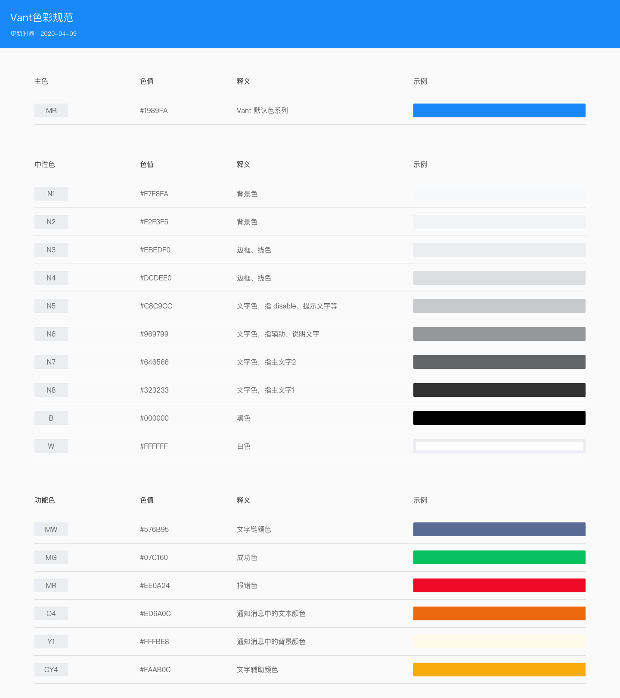

> 参考 [Vant4](https://vant-contrib.gitee.io/vant/#/zh-CN/home)

# 特性

> 下方支持程度图标说明
> - ✅ 完全支持
> - ⚠️ 部分支持
> - ℹ️ 计划实现，但暂时未实现
> - 🚫 不考虑实现（原生已经有更好的）

| 类型   | 组件                | 支持程度 | 备注              |
|:-----|:------------------|:-----|:----------------|
| 基础组件 | Button 按钮         | ⚠️   | 暂不支持渐变色背景、动画按钮  |
|      | Cell 单元格          | ✅    |                 |
|      | Toast 轻提示         | ✅    |                 |
| 表单组件 | Calendar 日历       | ℹ️   | TODO            |
|      | Cascader 级联选择     | ℹ️   | TODO            |
|      | Field 输入框         | ✅    |                 |
|      | Picker 选择器        | ✅    |                 |
|      | PickerGroup 选择器组  | ℹ️   | TODO            |
|      | Search 搜索         | ✅    |                 |
|      | Slider 滑块         | ℹ️   | TODO            |
|      | Stepper 步进器       | ✅    |                 |
|      | Switch 开关         | ✅    |                 |
|      | CheckButton 选择按钮  | ✅    |                 |
| 反馈组件 | Sheet 动作面板        | ✅    |                 |
|      | Dialog 弹出框        | ✅    |                 |
|      | DropdownMenu 下拉菜单 | ℹ️   | TODO            |
|      | Loading 加载        | ✅    |                 |
|      | Notify 消息提示       | ✅    |                 |
|      | Overlay 遮罩层       | ✅    |                 |
|      | ShareSheet 分享面板   | ℹ️   | TODO            |
|      | SwipeCell 滑动单元格   | ℹ️   | TODO            |
| 展示组件 | Badge 徽标          | ✅    |                 |
|      | Collapse 折叠面板     | ℹ️   | TODO            |
|      | CountDown 倒计时     | ℹ️   | TODO            |
|      | Divider 分割线       | 🚫   | 不考虑二次封装，建议选择原生  |
|      | Empty 空状态         | ℹ️   | TODO            |
|      | ImagePreview 图片预览 | ℹ️   | TODO            |
|      | NoticeBar 通知栏     | ℹ️   | TODO            |
|      | Popover 气泡弹出框     | ℹ️   | TODO            |
|      | Skeleton 骨架屏      | ℹ️   | TODO            |
|      | Steps 步骤条         | ⚠️   | 暂不支持自定义样式、竖向步骤条 |
|      | Swipe 轮播          | ℹ️   | TODO            |
|      | Tag 标签            | ✅    |                 |
|      | Avatar 头像         | ✅    |                 |
| 导航组件 | ActionBar 动作栏     | 🚫   |                 |
|      | BackTop 回到顶部      | 🚫   |                 |
|      | Grid 宫格           | 🚫   |                 |
|      | IndexBar 索引栏      | ℹ️   | TODO            |
|      | NavBar 导航栏        | ✅    |                 |
|      | Pagination 分页     | ℹ️   | TODO            |
|      | Sidebar 侧边导航      | ℹ️   | TODO            |
|      | Tab 标签页           | ℹ️   | TODO            |
|      | Tabbar 标签栏        | ℹ️   | TODO            |
|      | TreeSelect 分类选择   | ℹ️   | TODO            |

# 预览

                        

## demo运行
> 下载APK安装测试，[点击这里下载APK](./app/app-release.apk)

# 使用

> 最新版本 *ver = `2.0.0`*

1 添加仓库

```gradle 
allprojects {
  repositories {
    ...
    maven { url 'https://raw.githubusercontent.com/D10NGYANG/maven-repo/main/repository' }
  }
}
``` 

2 添加依赖

```gradle
dependencies {
    implementation("com.github.D10NGYANG:DLJetpackComposeUtil:$ver")
    // 必须：startup
    implementation("androidx.startup:startup-runtime:1.1.1")

    // 可选：Lifecycle
    implementation("androidx.lifecycle:lifecycle-runtime-ktx:$jetpack_lifecycle_ver")
    implementation("androidx.lifecycle:lifecycle-viewmodel-compose:$jetpack_lifecycle_ver")

    // 可选：Coroutines
    implementation("org.jetbrains.kotlinx:kotlinx-coroutines-core:$kotlin_coroutines_ver")
    implementation("org.jetbrains.kotlinx:kotlinx-coroutines-android:$kotlin_coroutines_ver")

    // 可选：导航路由
    implementation("io.github.raamcosta.compose-destinations:animations-core:$compose_destinations_ver")

    // 可选：时间工具
    implementation("com.github.D10NGYANG:DLDateUtil:1.8.5")
    coreLibraryDesugaring("com.android.tools:desugar_jdk_libs:2.0.3")
}
```

3 混淆

```pro
-keep class com.d10ng.compose.** {*;}
-dontwarn com.d10ng.compose.**
```

4 代码演示

> 直接查看demo中app模块里代码[/app/src/main/java/com/d10ng/compose/demo/pages/](./app/src/main/java/com/d10ng/compose/demo/pages/HomeScreen.kt)

5 颜色配置

根据[Vant4的色彩规范](https://vant-contrib.gitee.io/vant/#/zh-CN/design#se-cai-gui-fan)，我们定义一套可修改变量；


```kotlin
object AppColor {

    /**
     * 主色
     */
    object Main {
        var primary = Color(0xFF1989FA)
    }

    /**
     * 功能色
     */
    object Func {
        /**
         * 文字链颜色
         */
        var link = Color(0xFF576B95)

        /**
         * 成功色
         */
        var success = Color(0xFF07C160)

        /**
         * 错误色
         */
        var error = Color(0xFFEE0A24)

        /**
         * 通知消息中的文本颜色
         */
        var notice = Color(0xFFED6A0C)

        /**
         * 通知消息中的背景颜色
         */
        var noticeBg = Color(0xFFFFFBE8)

        /**
         * 文字辅助颜色
         */
        var assist = Color(0xFFFAAB0C)
    }

    /**
     * 中性色
     */
    object Neutral {
        /**
         * 中性色 1 页面背景色
         */
        var bg = Color(0xFFF7F8FA)

        /**
         * 中性色 2 item card 背景色
         */
        var card = Color(0xFFF2F3F5)

        /**
         * 中性色 3 边框、线色
         */
        var line = Color(0xFFEBEDF0)

        /**
         * 中性色 4 边框、线色
         */
        var border = Color(0xFFDCDEF0)

        /**
         * 中性色 5 文字色，disable、提示文本等
         */
        var hint = Color(0xFFC8C9CC)

        /**
         * 中性色 6 文字色，辅助、说明文本
         */
        var tips = Color(0xFF969799)

        /**
         * 中性色 7 主要文本2
         */
        var body = Color(0xFF646566)

        /**
         * 中性色 8 主要文本1
         */
        var title = Color(0xFF323233)
    }
}
```
*如果您有自定义颜色的需求，只需要执行如下代码即可：*
```kotlin
AppColor.Main.primary = Color(0xFF1989FA)
```

# 联系作者
欢迎提交issue，或者发送邮件到d10ngyang@163.com进行沟通。