# DLJetpackComposeUtil

jetpack compose android UI组件库，参考[Vant4](https://vant-contrib.gitee.io/vant/#/zh-CN/home)

# 特性

> 下方支持程度图标说明
> - ✅ 完全支持
> - ⚠️ 部分支持
> - ℹ️ 计划实现，但暂时未实现
> - 🚫 不考虑实现（原生已经有更好的）

| 类型   | 组件                | 支持程度 | 备注              |
|:-----|:------------------|:-----|:----------------|
| 基础组件 | Button 按钮         | ⚠️   | 暂不支持渐变色背景、动画按钮  |
|      | Cell 单元格          | ✅    |                 |
|      | Toast 轻提示         | ✅    |                 |
| 表单组件 | Calendar 日历       | ℹ️   | TODO            |
|      | Cascader 级联选择     | ℹ️   | TODO            |
|      | Field 输入框         | ✅    |                 |
|      | Picker 选择器        | ✅    |                 |
|      | PickerGroup 选择器组  | ℹ️   | TODO            |
|      | Search 搜索         | ✅    |                 |
|      | Slider 滑块         | ℹ️   | TODO            |
|      | Stepper 步进器       | ✅    |                 |
|      | Switch 开关         | ✅    |                 |
|      | CheckButton 选择按钮  | ✅    |                 |
| 反馈组件 | Sheet 动作面板        | ✅    |                 |
|      | Dialog 弹出框        | ✅    |                 |
|      | DropdownMenu 下拉菜单 | ℹ️   | TODO            |
|      | Loading 加载        | ✅    |                 |
|      | Notify 消息提示       | ✅    |                 |
|      | Overlay 遮罩层       | ✅    |                 |
|      | ShareSheet 分享面板   | ℹ️   | TODO            |
|      | SwipeCell 滑动单元格   | ℹ️   | TODO            |
| 展示组件 | Badge 徽标          | ✅    |                 |
|      | Collapse 折叠面板     | ℹ️   | TODO            |
|      | CountDown 倒计时     | ℹ️   | TODO            |
|      | Divider 分割线       | 🚫   | 不考虑二次封装，建议选择原生  |
|      | Empty 空状态         | ℹ️   | TODO            |
|      | ImagePreview 图片预览 | ℹ️   | TODO            |
|      | NoticeBar 通知栏     | ℹ️   | TODO            |
|      | Popover 气泡弹出框     | ℹ️   | TODO            |
|      | Skeleton 骨架屏      | ℹ️   | TODO            |
|      | Steps 步骤条         | ⚠️   | 暂不支持自定义样式、竖向步骤条 |
|      | Swipe 轮播          | ℹ️   | TODO            |
|      | Tag 标签            | ✅    |                 |
|      | Avatar 头像         | ✅    |                 |
| 导航组件 | ActionBar 动作栏     | 🚫   |                 |
|      | BackTop 回到顶部      | 🚫   |                 |
|      | Grid 宫格           | 🚫   |                 |
|      | IndexBar 索引栏      | ℹ️   | TODO            |
|      | NavBar 导航栏        | ✅    |                 |
|      | Pagination 分页     | ℹ️   | TODO            |
|      | Sidebar 侧边导航      | ℹ️   | TODO            |
|      | Tab 标签页           | ℹ️   | TODO            |
|      | Tabbar 标签栏        | ℹ️   | TODO            |
|      | TreeSelect 分类选择   | ℹ️   | TODO            |

# 预览

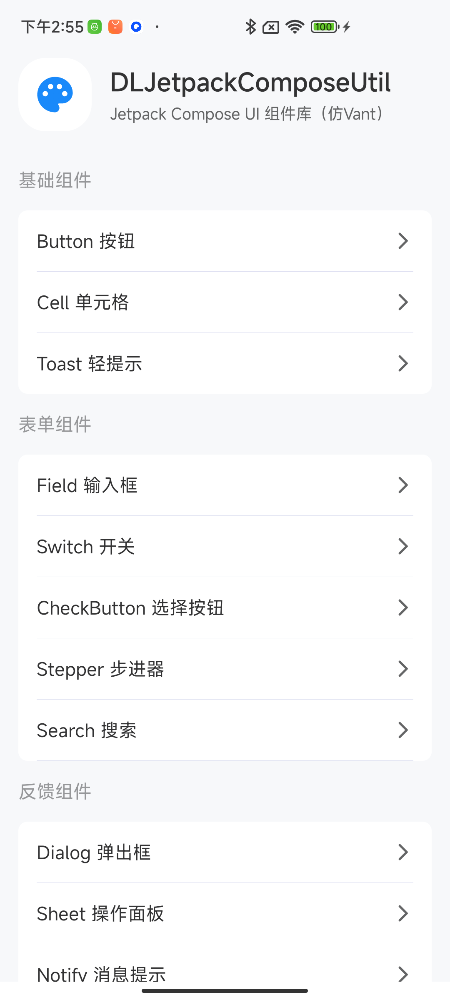
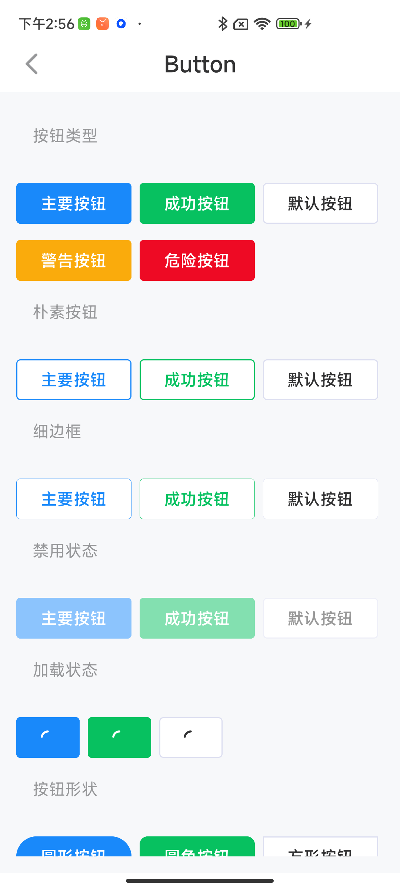
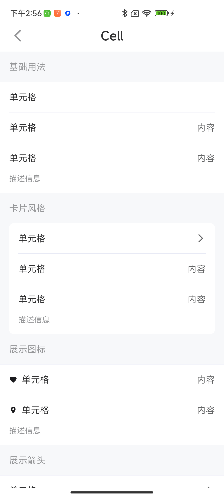
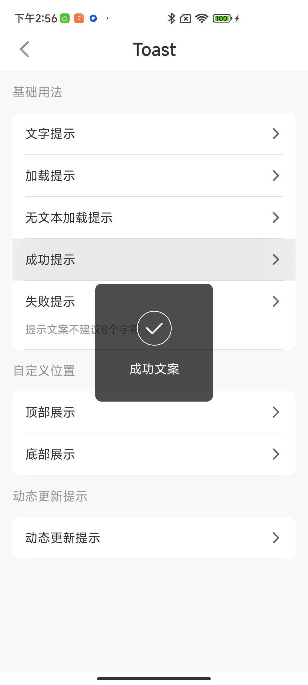
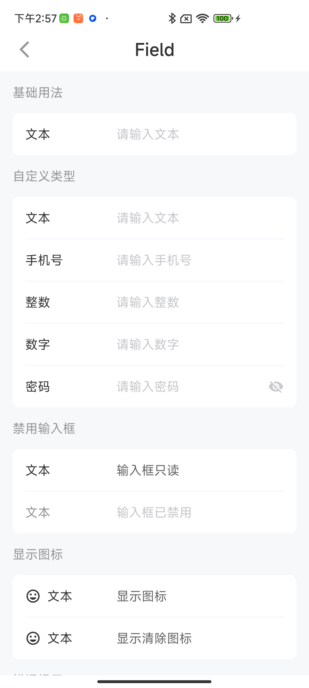
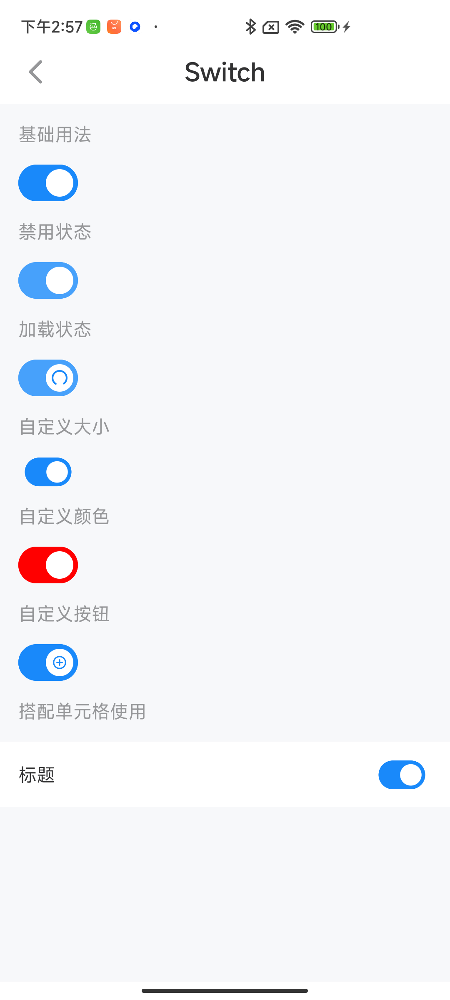

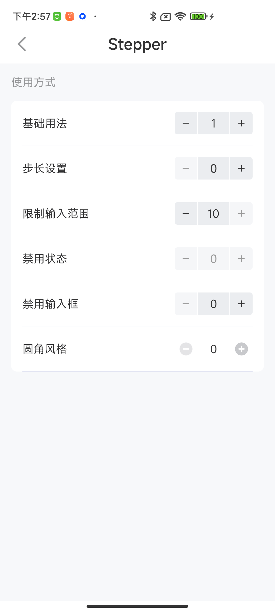
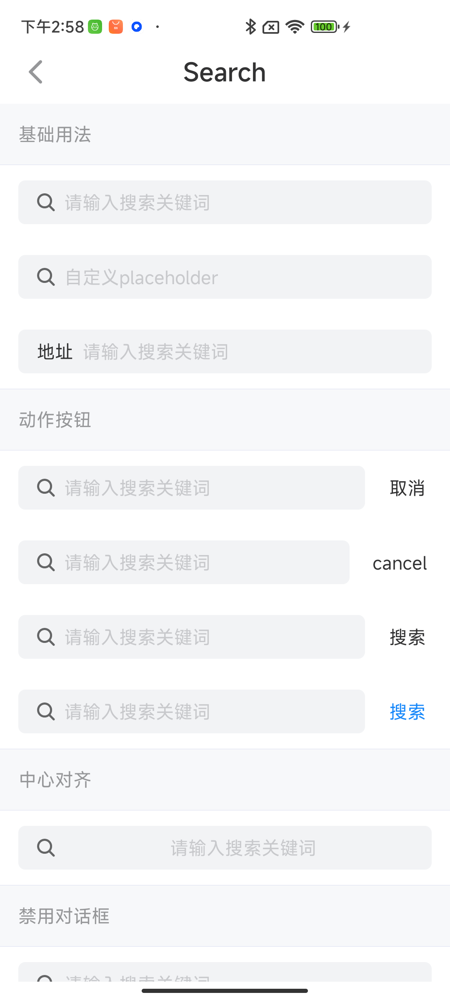
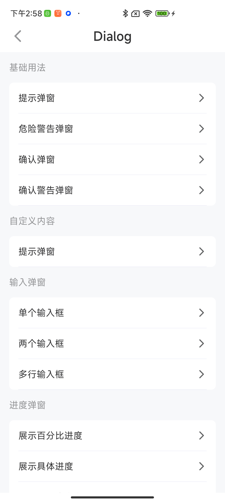

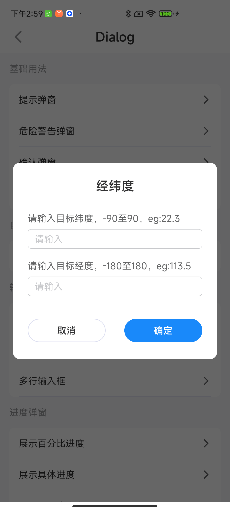
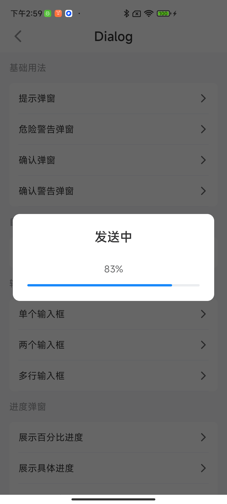
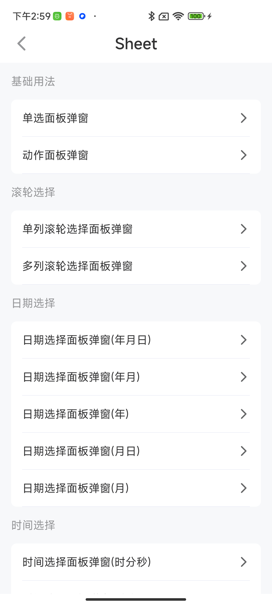
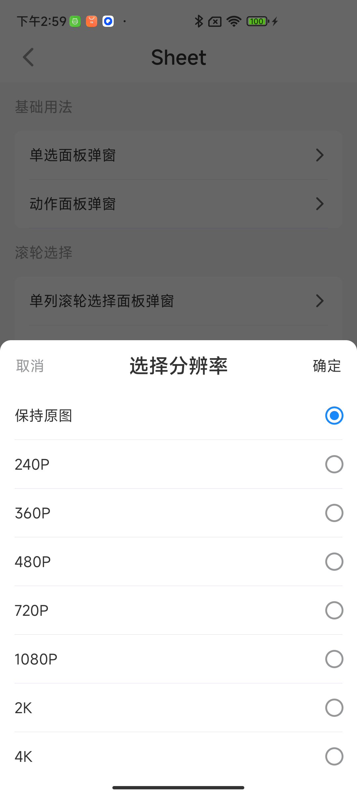
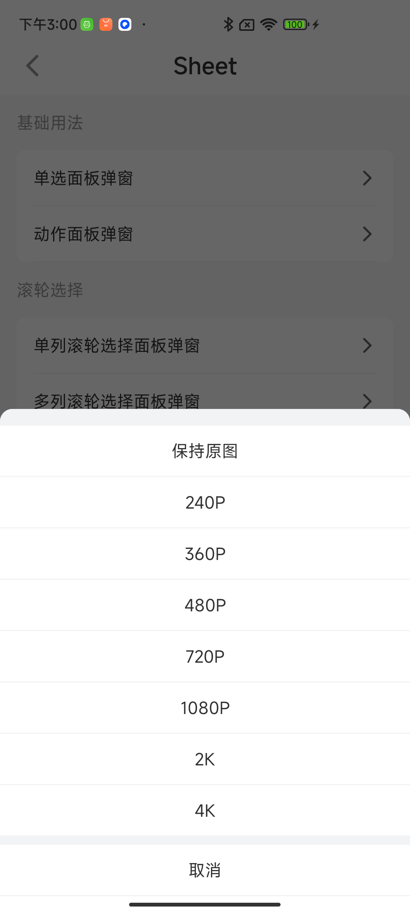
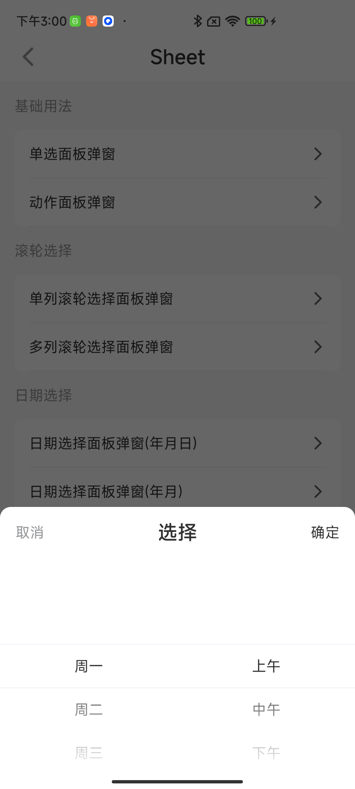
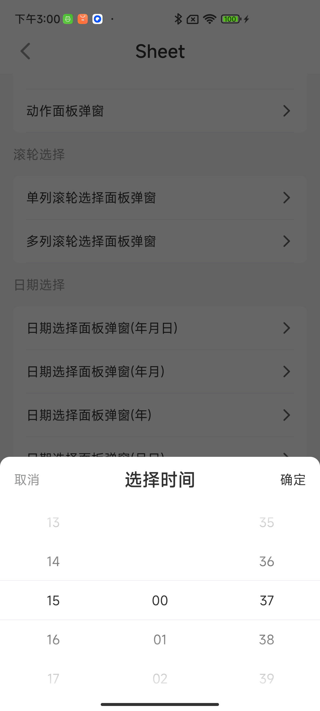
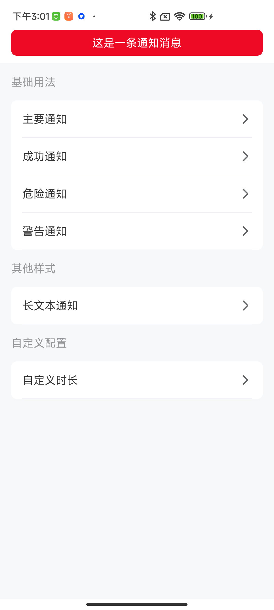
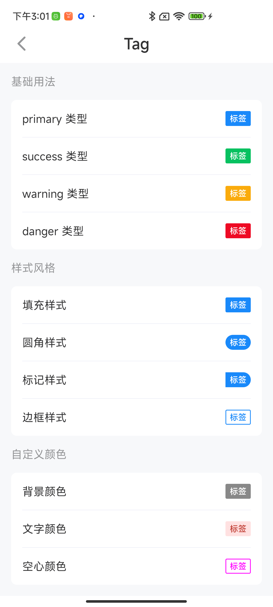
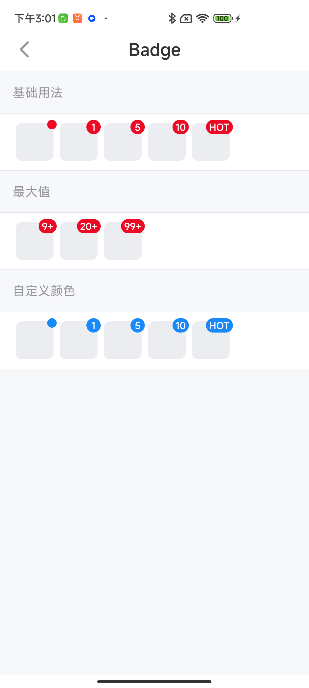
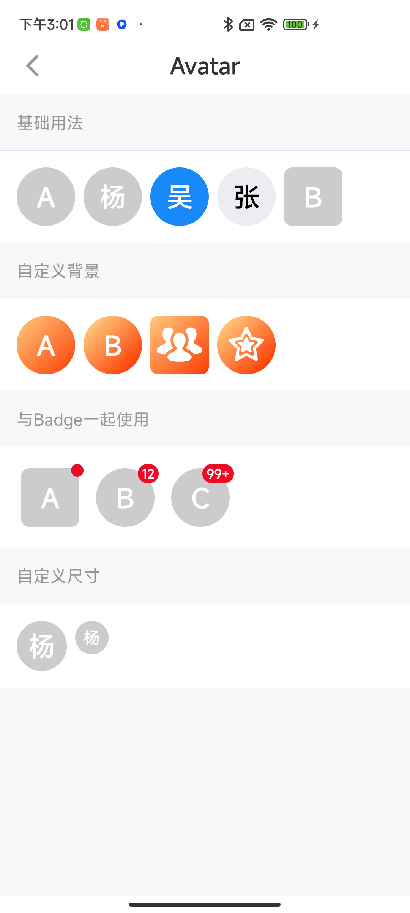
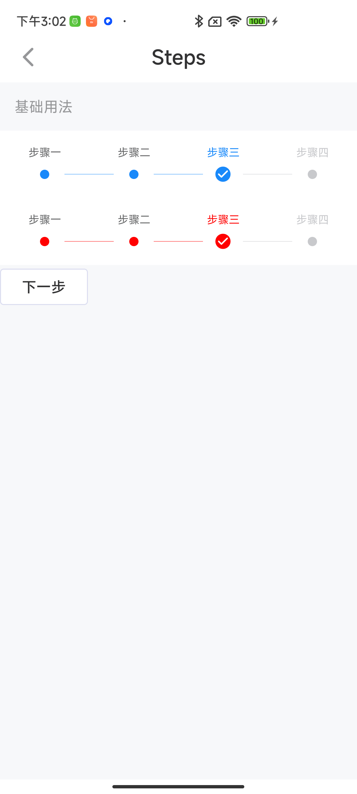
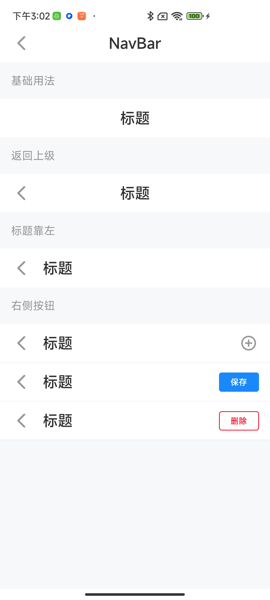

## demo运行

# 使用

> 最新版本 *ver = `2.0.0`*

1 添加仓库

```gradle 
allprojects {
  repositories {
    ...
    maven { url 'https://raw.githubusercontent.com/D10NGYANG/maven-repo/main/repository' }
  }
}
``` 

2 添加依赖

```gradle
dependencies {
    implementation 'com.github.D10NGYANG:DLJetpackComposeUtil:$ver'
}
```

3 混淆

```pro
-keep class com.d10ng.compose.** {*;}
-dontwarn com.d10ng.compose.**
```

4 代码演示
> 直接查看demo中app模块里代码`/app/src/main/java/com/d10ng/compose/demo/pages/`